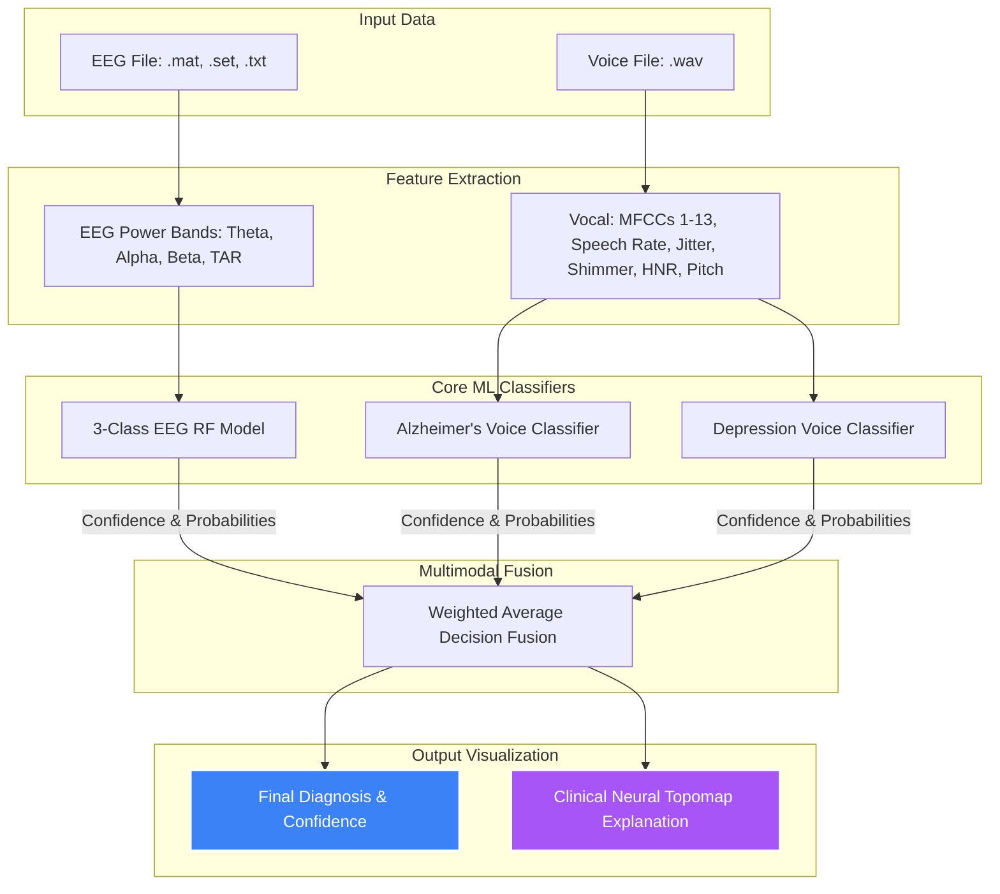

# 🧠 CogniVoice: Multimodal Differential Diagnosis System

CogniVoice is a premium research and clinical utility designed for **multimodal differential diagnosis** between **Alzheimer's Disease (AD)**, **Clinical Depression**, and **Healthy Controls**. By fusing neural electrical signals (**EEG**) and vocal acoustic features (**Voice**), CogniVoice leverages hybrid machine learning classifiers to deliver cross-validated, high-confidence clinical insights.

---

## 📐 System Architecture & Data Flow



---

## ✨ Features

- **Multimodal Decision Fusion:** Dynamically weights voice and EEG probabilities based on model confidence matrices (powered to the 4th degree for peak signal polarization).
- **Automated EEG Calibrator:** Automatically detects raw signal scales, maps frequency ranges, and handles dataset-specific calibrations (e.g. Bonn vs. MODMA baselines).
- **Praat Acoustic Extraction:** Integrates Praat algorithms via `parselmouth` for laboratory-grade pitch, jitter, shimmer, and Harmonicity-to-Noise Ratio (HNR) computation.
- **Topographical Visualization:** Generates and embeds an Alpha Power Topomap for spatial localization of neural activity during classification.

---

## 📂 File Directory Overview

Here is an overview of the core files in this repository:

### Application & User Interface
* **[cognivoice_app.py](file:///Users/aathirashibu/Documents/CogniVoice%20/cognivoice_app.py):** Streamlit dashboard featuring patient profiles, file upload portals, and interactive fusion diagnosis visualizations.
* **[generate_patient_report.py](file:///Users/aathirashibu/Documents/CogniVoice%20/generate_patient_report.py):** Main reporting engine that processes EEG data, executes classifications, and plots topological heatmaps.

### Machine Learning Core
* **[cognivoice_master_fusion.py](file:///Users/aathirashibu/Documents/CogniVoice%20/cognivoice_master_fusion.py):** Integrates and balances the individual model probabilites using a weighted average.
* **[alzheimers_fusion_system.py](file:///Users/aathirashibu/Documents/CogniVoice%20/alzheimers_fusion_system.py) & [depression_fusion_system.py](file:///Users/aathirashibu/Documents/CogniVoice%20/depression_fusion_system.py):** Subsystem modules defining individual classifier thresholds.
* **[voice_feature_extractor.py](file:///Users/aathirashibu/Documents/CogniVoice%20/voice_feature_extractor.py):** The single source of truth for raw voice feature processing.

### Model Training
* **[train_3class_model.py](file:///Users/aathirashibu/Documents/CogniVoice%20/train_3class_model.py):** Pipeline for 3-class EEG Random Forest model with SMOTE class balancing.
* **[train_alzh_voice_model.py](file:///Users/aathirashibu/Documents/CogniVoice%20/train_alzh_voice_model.py) & [train_depress_voice_model.py](file:///Users/aathirashibu/Documents/CogniVoice%20/train_depress_voice_model.py):** Acoustic models trained on MFCCs, jitter, shimmer, and speech patterns.

---

## 🚀 Setup & Execution

### 1. Clone & Set Up Virtual Environment
```bash
# Clone the repository (once uploaded)
git clone <your-repository-url>
cd CogniVoice

# Create and activate virtual environment
python3 -m venv venv
source venv/bin/activate

# Install dependencies
pip install -r requirements.txt
```

### 2. Model Files (`*.pkl`)
> [!IMPORTANT]
> Because model binary files (`.pkl`) and dataset directories (`data_alzheimers/`, `data_depression/`) are excluded from Git to keep the repository lightweight, you must train the models locally before launching the application:

```bash
# Train the voice and EEG models
python train_3class_model.py
python train_alzh_voice_model.py
python train_depress_voice_model.py
```
This will output the serialized models and scalers (e.g., `model_3class_eeg.pkl`, `scaler_eeg.pkl`, etc.) to the root folder.

### 3. Launch Streamlit Application
```bash
streamlit run cognivoice_app.py
```

---

## 🛠️ Git Ignored Artifacts
The following directories and files are configured in `.gitignore` to avoid bloating the remote repository:
- **`venv/`**: Local Python environment.
- **`*.pkl` & `*.scaler`**: Compiled machine learning binaries and features.
- **`data_alzheimers/`, `data_depression/`, `Multimodel_Dataset/`, `Test data/`**: Large datasets containing raw audio files and high-density EEG matrices.
- **`temp_eeg.*`, `temp_voice.wav`**: Ephemeral buffer files created during upload analysis.
